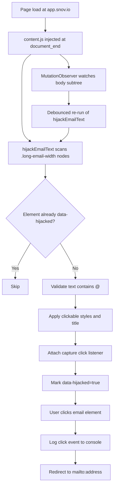

# Snov.io Interaction Logging Library (Click-to-Compose)

A Manifest V3 browser-side logging and interaction automation library for Snov.io that detects email elements in real time and converts them into actionable `mailto:` workflows.

[](manifest.json)
[](manifest.json)
[](LICENSE)
[](manifest.json)

> [!NOTE]
> This project is implemented as a Chrome Extension content-script package, but its core runtime behavior functions like a focused DOM interaction/logging library embedded into `https://app.snov.io/*`.

## Related Projects

This tool is part of the **AdTech Automation Suite**. Check out the companion extension:

| Project | Type | Description |
| :--- | :--- | :--- |
| **[Snov.io Addon: Blocklist Highlighter](https://github.com/OstinUA/Snov.io-addon_1)** | Chrome Extension | Real-time visual flagging of blacklisted or bounced emails |
| **[Snov.io Addon: Click-to-Compose](https://github.com/OstinUA/Snov.io-addon_2)** | Chrome Extension | Instantly converts static email text into clickable `mailto:` links |

## Table of Contents

- [Features](#features)
- [Tech Stack & Architecture](#tech-stack--architecture)
- [Getting Started](#getting-started)
- [Testing](#testing)
- [Deployment](#deployment)
- [Usage](#usage)
- [Configuration](#configuration)
- [License](#license)
- [Contacts & Community Support](#contacts--community-support)

## Features

- Real-time DOM scanning for Snov.io email UI nodes (`.long-email-width`).
- Deterministic click hijacking of static email text into `mailto:` handlers.
- Built-in lightweight runtime logging via `console.log` for extension activation and click events.
- Mutation-aware processing through `MutationObserver` for SPA and async-rendered content.
- Duplicate-processing prevention using `data-hijacked` tagging on processed nodes.
- UX affordances for interactable nodes:
  - Pointer cursor for clickable discoverability.
  - Consistent branded accent color (`#6d53de`).
  - Contextual hover title with recipient preview.
- Strict host scoping to `https://app.snov.io/*` to reduce permission surface.
- Zero external runtime dependencies (plain JavaScript content script).
- Chrome Extension Manifest V3 compatibility.
- Internal-tooling-friendly architecture with predictable load timing (`document_end`).

> [!TIP]
> Because processing is idempotent (`dataset.hijacked` guard), the observer can run continuously without repeatedly binding listeners to the same element.

## Tech Stack & Architecture

### Core Technologies

- **Language:** JavaScript (ES6+ syntax in browser context).
- **Platform:** Google Chrome Extension APIs via Manifest V3.
- **Runtime Model:** Content script injection on matching host patterns.
- **Browser APIs:**
  - `document.querySelectorAll`
  - `MutationObserver`
  - `window.location.href` (`mailto:` redirect)
  - `HTMLElement.dataset`, inline style mutation, and event listeners

### Project Structure

```text
Snov.io-addon_2/
├── content.js          # Core library logic: detection, hijacking, observer loop, click logging
├── manifest.json       # Extension metadata, host permissions, content script registration
├── icons/
│   └── icon128.png     # Extension icon asset
├── LICENSE             # Apache 2.0 license
└── README.md           # Project documentation
```

### Key Design Decisions

1. **Content-script-only architecture**
   - Keeps execution close to target DOM.
   - Eliminates background-message complexity for this use case.

2. **Mutation-driven refresh strategy**
   - Supports dynamic Snov.io views where nodes arrive after initial page load.
   - Avoids brittle one-time initialization patterns.

3. **Debounced reprocessing (`setTimeout`)**
   - Coalesces multiple rapid DOM mutations into one pass.
   - Reduces unnecessary query work in high-change interfaces.

4. **Element-level idempotency marker**
   - Uses `data-hijacked="true"` to prevent duplicate handlers.
   - Keeps algorithm predictable even under frequent rerenders.

5. **Protocol-native integration (`mailto:`)**
   - Delegates compose experience to user’s default mail client.
   - Avoids third-party API coupling.

### Runtime Data Flow



> [!IMPORTANT]
> The extension intentionally intercepts click behavior (`preventDefault` and `stopPropagation`) in capture mode to ensure consistent compose handoff from complex nested UI widgets.

## Getting Started

### Prerequisites

- Google Chrome (or Chromium-based browser supporting Manifest V3).
- Git (for cloning the repository).
- Optional for local quality checks:
  - Node.js 18+
  - npm 9+

### Installation

1. Clone the repository:

```bash
git clone https://github.com/OstinUA/Snov.io-addon_2.git
cd Snov.io-addon_2
```

2. Load extension in Chrome:

```text
chrome://extensions/ -> enable Developer mode -> Load unpacked -> select this folder
```

3. Open `https://app.snov.io/` and verify behavior:
   - Email text elements become clickable.
   - Click opens default mail client compose window.

> [!WARNING]
> This extension only activates on `https://app.snov.io/*`. It will not execute on other domains.

## Testing

This repository does not ship a formal unit/integration test harness yet, but the following commands provide a practical validation baseline.

### Static and Syntax Checks

```bash
# JavaScript syntax validation (built-in)
node --check content.js

# Optional linting (requires Node.js + npm)
npx eslint content.js

# Optional extension manifest linting
npx web-ext lint --source-dir .
```

### Functional Integration Validation (Manual)

1. Reload the unpacked extension in `chrome://extensions/`.
2. Open `https://app.snov.io/`.
3. In DevTools Console, confirm startup log:
   - `Snov Email-Click: Active`
4. Click a transformed email node and verify:
   - Console event log is emitted.
   - `mailto:` compose flow is triggered.

### Suggested CI Checks

For CI pipelines (GitHub Actions, GitLab CI, Jenkins), run:

```bash
node --check content.js
npx eslint content.js
npx web-ext lint --source-dir .
```

## Deployment

This project is deployed as an unpacked internal extension or packaged Chrome extension artifact.

### Option A: Internal Unpacked Deployment

- Distribute repository folder to internal users.
- Users load via Chrome Developer Mode (`Load unpacked`).
- Update by pulling latest Git commit and reloading extension.

### Option B: Packaged Distribution

- Use Chrome extension packaging tooling to build `.crx` (for controlled internal channels).
- Keep `manifest.json` version updated for release tracking.

### CI/CD Integration Recommendations

- Trigger quality gates on pull requests (`node --check`, lint, manifest validation).
- Enforce semantic version bump in `manifest.json` for release PRs.
- Archive release artifacts with commit hash and extension version metadata.

> [!CAUTION]
> If you add broader host permissions in future releases, perform a security review before publishing or distributing internally.

## Usage

### Minimal Runtime Behavior

```javascript
// Detect target email nodes
const emailElements = document.querySelectorAll('.long-email-width');

emailElements.forEach((emailEl) => {
  if (emailEl.dataset.hijacked) return; // Skip already processed elements

  const emailText = emailEl.innerText.trim();
  if (!emailText.includes('@')) return; // Basic guard for email-like values

  emailEl.style.cursor = 'pointer';
  emailEl.style.color = '#6d53de';
  emailEl.title = `Write email: ${emailText}`;

  emailEl.addEventListener('click', (e) => {
    e.preventDefault();
    e.stopPropagation();
    console.log(`Email clicked -> Mailto: ${emailText}`);
    window.location.href = `mailto:${emailText}`; // Delegate to OS/client mail handler
  }, true);

  emailEl.dataset.hijacked = 'true';
});
```

### Observer-Driven Reprocessing Pattern

```javascript
let timeout;
const observer = new MutationObserver(() => {
  clearTimeout(timeout);
  timeout = setTimeout(hijackEmailText, 500); // Debounced rescanning on DOM churn
});

observer.observe(document.body, {
  childList: true,
  subtree: true,
});

hijackEmailText(); // Initial pass
```

### Practical Extension Workflow

1. Install extension in Developer Mode.
2. Navigate to Snov.io lead/contact views.
3. Click converted email values to initiate compose immediately.
4. Use browser console logs for quick behavioral diagnostics.

## Configuration

### `manifest.json`

| Field | Description | Current Value |
| :--- | :--- | :--- |
| `manifest_version` | Extension manifest standard | `3` |
| `name` | Display name in browser extensions page | `Snov.io addon_2dev` |
| `version` | Release/version identifier | `1.2.0` |
| `description` | Extension summary | `Click the copy icon to instantly compose an email...` |
| `host_permissions` | Allowed origin scope | `https://app.snov.io/*` |
| `content_scripts.matches` | Injection URL pattern | `https://app.snov.io/*` |
| `content_scripts.run_at` | Script execution timing | `document_end` |

### Runtime Parameters (Code-Level)

| Parameter | Location | Purpose | Default |
| :--- | :--- | :--- | :--- |
| CSS selector | `content.js` | Target email text elements | `.long-email-width` |
| Accent color | `content.js` | Visual clickable indication | `#6d53de` |
| Debounce window | `content.js` | Mutation processing delay | `500ms` |
| Guard attribute | `content.js` | Prevent duplicate listeners | `data-hijacked` |

### Environment Variables

This project currently uses **no `.env` variables** and **no startup CLI flags**. Configuration is static and controlled through `manifest.json` and constants in `content.js`.

> [!NOTE]
> For enterprise-grade configurability, consider introducing build-time environment injection (e.g., selector overrides, debug mode toggles, style theme values).

## License

Licensed under the **Apache License 2.0**. See [`LICENSE`](LICENSE) for the full text.

## Contacts & Community Support

## Support the Project

[](https://www.patreon.com/OstinFCT)
[](https://ko-fi.com/fctostin)
[](https://boosty.to/ostinfct)
[](https://www.youtube.com/@FCT-Ostin)
[](https://t.me/FCTostin)

If you find this tool useful, consider leaving a star on GitHub or supporting the author directly.
